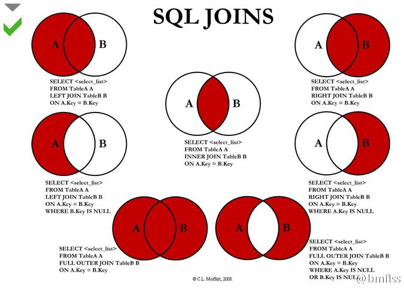

[TOC]


# 查询

## 前期数据准备

```mysql
/*
Navicat MySQL Data Transfer

Source Server         : TC35
Source Server Version : 80013
Source Host           : localhost:3306
Source Database       : tc35

Target Server Type    : MYSQL
Target Server Version : 80013
File Encoding         : 65001

Date: 2018-11-12 10:30:19
*/

SET FOREIGN_KEY_CHECKS=0;

-- ----------------------------
-- Table structure for employee
-- ----------------------------
DROP TABLE IF EXISTS `employee`;
CREATE TABLE `employee` (
  `num` int(11) unsigned NOT NULL AUTO_INCREMENT,
  `name` varchar(50) NOT NULL,
  `age` int(11) unsigned NOT NULL DEFAULT '18',
  `sex` varchar(10) NOT NULL DEFAULT '男',
  `address` varchar(100) NOT NULL,
  PRIMARY KEY (`num`)
) ENGINE=InnoDB AUTO_INCREMENT=5 DEFAULT CHARSET=utf8;

-- ----------------------------
-- Records of employee
-- ----------------------------
INSERT INTO `employee` VALUES ('1', '张三', '18', '男', '南京东路');
INSERT INTO `employee` VALUES ('2', ' 李四', '19', '女', '南京西路');
INSERT INTO `employee` VALUES ('3', '王五', '20', '男', '南京北路');
INSERT INTO `employee` VALUES ('4', '赵六', '17', '女', '南京南路');

```

## 简单查询

### 列出表中所有字段的查询

在MySQL中，我们通过使用***Select***语句来实现从数据库表中获取数据。这种方式可以把表中的所有字段都显示出来。在MySQL中有两种方式来实现

1.  列出所有的字段
2.  使用星号

```mysql
select num,name,age,sex,address from employee;
```

```mysql
select * from employee;
```

两种写法都可以实现把表中的所有字段都列出来。但是一般在实际的开发中，要查询所有字段的概率几乎为0.所以不推荐使用星号的写法。除此以外还有一个原因，在开发时，我们都是根据目标去查特定的内容，如果使用星号就会把所有的内容都查询出来，这样会造成资源浪费。

### 列出表中指定字段

其实就是列出所有字段的变种。把所有字段减少，减少到你想要的那几个字段。比如这里想要获取所有员工的姓名

```mysql
select name from employee;
```

### MySQL的别名机制

所谓的别名就是使用AS。我们可以在字段的后面使用AS 跟别名来进行查询。这样的效果是查询得到的临时表的列名就是别名。


### 使用Where子句进行条件查询

无论属性列表中是全部字段还是部分字段，我们所得到的都是全部的数据。就是select * 和 select name区别在于所得到的列不一样，而行数是一样的。每一行代表一个数据实体，我们往往想要的只是其中一个，这就需要指定条件来确定实体。这个条件就应该是可以唯一标识实体的存在。比如我想要张三的全部数据

```mysql
select * from employee where name = '张三';
```

where的查询条件有很多种写法,可以参考下表

|     查询条件      |         符号或者关键字          |
| :---------------: | :-----------------------------: |
|       比较        | =、<、<=、>、>=、!=、<>、!>、!< |
|     指定范围      |  between and 、not between and  |
|     指定集合      |           in、not in            |
| 匹配字符/模糊查询 |         like、not like          |
|    是否为空值     |      is null、is not null       |
| 多个条件组合查询  |             and、or             |

*   <> 和 ！= 代表一个含义：不等于
*   ！> 不大于
*   ！< 不小于

### 带有In关键字的查询

比如这里只想要张三和李四的数据。我们可以把员工姓名作为条件，设定名字的取值集合。

```mysql
# 只想要张三和李四
select * from employee where name = '张三' or name = '李四';
select * from employee where name in('张三','李四');

# 想要那些不是张三和李四的
select * from employee where name != '张三' and name <> '李四';
select * from employee where name not in('张三','李四');
```

### 代表Between and的范围查询

between and 关键字可以判断某个字段的值，是否在指定的范围内。如果在就满足查询条件，记录会被查询出来，否则就不满足。它的语法格式

```mysql
[not] between 取值1 and 取值2
```

比如我们使用该语句来查询员工编号取值1-3之间的员工信息。

```mysql
# 使用between and 查询员工编号为1-3之间的。
select * from employee where num BETWEEN 1 and 3;
```

需要注意的是这里的1和3是都可以去得到的。所以我们将会得到3条数据。如果把前面的not加上，就代表员工编号不在1-3之间。当前有4条数据。得到就应该是员工编号为4的。语句如下

```mysql
# 使用between and 查询员工编号不在1-3之间的。
select * from employee where num not BETWEEN 1 and 3;
```

### 使用Like的字符匹配进行模糊查询

Like关键字可以匹配字符是否相等。在MySQL中一共提供了两种通配符

*   % 代表任意长度的字符，长度可以为0
*   _ 代表单个字符

我们使用like和通配符来进行模糊查询。比如查询名字中带有一个风的。当前所有数据如下

```mysql
mysql> select * from employee;
+-----+-----------+-----+-----+--------------+
| num | name      | age | sex | address      |
+-----+-----------+-----+-----+--------------+
|   1 | 张三      |  18 | 男  | 南京东路     |
|   2 | 李四      |  19 | 女  | 南京西路     |
|   3 | 王五      |  20 | 男  | 南京北路     |
|   4 | 赵六      |  17 | 女  | 南京南路     |
|   5 | 张三丰    |  50 | 男  | 武当山       |
|   6 | 弓长张    |  50 | 男  | 武夷山       |
|   7 | 梅超风    |  30 | 女  | 山洞里       |
|   8 | 李莫愁    |  40 | 女  | 古墓里       |
|   9 | 欧阳风    |  50 | 男  | 风里         |
+-----+-----------+-----+-----+--------------+
9 rows in set (0.00 sec)
```

查询的sql语句如下

```mysql
mysql> select * from employee where name like '风';
Empty set (0.00 sec)
# 我们对语句来进行修改，添加占位符
mysql> select * from employee where name like '%风';
+-----+-----------+-----+-----+-----------+
| num | name      | age | sex | address   |
+-----+-----------+-----+-----+-----------+
|   7 | 梅超风    |  30 | 女  | 山洞里    |
|   9 | 欧阳风    |  50 | 男  | 风里      |
+-----+-----------+-----+-----+-----------+
2 rows in set (0.00 sec)
#上面使用了%分号，按下面我们测试下张三和张三丰
mysql> select * from employee where name like '张%';
+-----+-----------+-----+-----+--------------+
| num | name      | age | sex | address      |
+-----+-----------+-----+-----+--------------+
|   1 | 张三      |  18 | 男  | 南京东路     |
|   5 | 张三丰    |  50 | 男  | 武当山       |
+-----+-----------+-----+-----+--------------+
2 rows in set (0.00 sec)

mysql> select * from employee where name like '张_';
+-----+--------+-----+-----+--------------+
| num | name   | age | sex | address      |
+-----+--------+-----+-----+--------------+
|   1 | 张三   |  18 | 男  | 南京东路     |
+-----+--------+-----+-----+--------------+
1 row in set (0.00 sec)

mysql>
```

同理我们一样也可以在like的前面加上not。如下语句

```mysql
mysql> select * from employee where name not like '张_';
+-----+-----------+-----+-----+--------------+
| num | name      | age | sex | address      |
+-----+-----------+-----+-----+--------------+
|   2 | 李四      |  19 | 女  | 南京西路     |
|   3 | 王五      |  20 | 男  | 南京北路     |
|   4 | 赵六      |  17 | 女  | 南京南路     |
|   5 | 张三丰    |  50 | 男  | 武当山       |
|   6 | 弓长张    |  50 | 男  | 武夷山       |
|   7 | 梅超风    |  30 | 女  | 山洞里       |
|   8 | 李莫愁    |  40 | 女  | 古墓里       |
|   9 | 欧阳风    |  50 | 男  | 风里         |
+-----+-----------+-----+-----+--------------+
8 rows in set (0.00 sec)
```

### 判断是否为空值

判断是否为空值所使用的关键字是is null。如果该记录是空值则满足条件

```mysql
mysql> select * from employee where name is null;
Empty set (0.00 sec)
```

因为所有行的名字都是有值得，所以使用is null作为判断条件得到的结果为空。如果使用is not null，将会获取所有数据

```mysql
mysql> select * from employee where name is not null;
+-----+-----------+-----+-----+--------------+
| num | name      | age | sex | address      |
+-----+-----------+-----+-----+--------------+
|   1 | 张三      |  18 | 男  | 南京东路     |
|   2 | 李四      |  19 | 女  | 南京西路     |
|   3 | 王五      |  20 | 男  | 南京北路     |
|   4 | 赵六      |  17 | 女  | 南京南路     |
|   5 | 张三丰    |  50 | 男  | 武当山       |
|   6 | 弓长张    |  50 | 男  | 武夷山       |
|   7 | 梅超风    |  30 | 女  | 山洞里       |
|   8 | 李莫愁    |  40 | 女  | 古墓里       |
|   9 | 欧阳风    |  50 | 男  | 风里         |
+-----+-----------+-----+-----+--------------+
9 rows in set (0.00 sec)
```

### 使用and 或者 or来组成多条件查询

```mysql
mysql> select * from employee where address like '%路' and sex = '男';
+-----+--------+-----+-----+--------------+
| num | name   | age | sex | address      |
+-----+--------+-----+-----+--------------+
|   1 | 张三   |  18 | 男  | 南京东路     |
|   3 | 王五   |  20 | 男  | 南京北路     |
+-----+--------+-----+-----+--------------+
2 rows in set (0.00 sec)

mysql> select * from employee where address like '%路' or sex = '男';
+-----+-----------+-----+-----+--------------+
| num | name      | age | sex | address      |
+-----+-----------+-----+-----+--------------+
|   1 | 张三      |  18 | 男  | 南京东路     |
|   2 | 李四      |  19 | 女  | 南京西路     |
|   3 | 王五      |  20 | 男  | 南京北路     |
|   4 | 赵六      |  17 | 女  | 南京南路     |
|   5 | 张三丰    |  50 | 男  | 武当山       |
|   6 | 弓长张    |  50 | 男  | 武夷山       |
|   9 | 欧阳风    |  50 | 男  | 风里         |
+-----+-----------+-----+-----+--------------+
7 rows in set (0.00 sec)

mysql>

```

and 是必须两个条件都成立，or是满足一个就可以了。

### 查询不重复的结果

使用关键字***distinct***来修饰字段，标示该字段的值不重复

```mysql
mysql> select distinct age from employee;
+-----+
| age |
+-----+
|  18 |
|  19 |
|  20 |
|  17 |
|  50 |
|  30 |
|  40 |
+-----+
7 rows in set (0.00 sec)
```

只能修饰一列且一定是位于类名前面。

### 排序查询

```mysql
mysql> select * from employee order by age desc;
+-----+-----------+-----+-----+--------------+
| num | name      | age | sex | address      |
+-----+-----------+-----+-----+--------------+
|   5 | 张三丰    |  50 | 男  | 武当山       |
|   6 | 弓长张    |  50 | 男  | 武夷山       |
|   9 | 欧阳风    |  50 | 男  | 风里         |
|   8 | 李莫愁    |  40 | 女  | 古墓里       |
|   7 | 梅超风    |  30 | 女  | 山洞里       |
|   3 | 王五      |  20 | 男  | 南京北路     |
|   2 | 李四      |  19 | 女  | 南京西路     |
|   1 | 张三      |  18 | 男  | 南京东路     |
|   4 | 赵六      |  17 | 女  | 南京南路     |
+-----+-----------+-----+-----+--------------+
9 rows in set (0.00 sec)
```

以年龄作为排序条件。desc代表降序，asc代表升序或者默认什么不写。能够使用多字段排序

```mysql
mysql> select * from employee order by age desc;
+-----+-----------+-----+-----+--------------+
| num | name      | age | sex | address      |
+-----+-----------+-----+-----+--------------+
|   5 | 张三丰    |  50 | 男  | 武当山       |
|   6 | 弓长张    |  50 | 男  | 武夷山       |
|   9 | 欧阳风    |  50 | 男  | 风里         |
|   8 | 李莫愁    |  40 | 女  | 古墓里       |
|   7 | 梅超风    |  30 | 女  | 山洞里       |
|   3 | 王五      |  20 | 男  | 南京北路     |
|   2 | 李四      |  19 | 女  | 南京西路     |
|   1 | 张三      |  18 | 男  | 南京东路     |
|   4 | 赵六      |  17 | 女  | 南京南路     |
+-----+-----------+-----+-----+--------------+
9 rows in set (0.00 sec)

mysql> select * from employee order by age,name desc;
+-----+-----------+-----+-----+--------------+
| num | name      | age | sex | address      |
+-----+-----------+-----+-----+--------------+
|   4 | 赵六      |  17 | 女  | 南京南路     |
|   1 | 张三      |  18 | 男  | 南京东路     |
|   2 | 李四      |  19 | 女  | 南京西路     |
|   3 | 王五      |  20 | 男  | 南京北路     |
|   7 | 梅超风    |  30 | 女  | 山洞里       |
|   8 | 李莫愁    |  40 | 女  | 古墓里       |
|   9 | 欧阳风    |  50 | 男  | 风里         |
|   5 | 张三丰    |  50 | 男  | 武当山       |
|   6 | 弓长张    |  50 | 男  | 武夷山       |
+-----+-----------+-----+-----+--------------+
9 rows in set (0.00 sec)

mysql>
```

可以使用多字段作为排序条件，那能否在多字段排序时，一个字段降序，一个字段升序呢？其实上面的代码就已经在做这件事情。by age 后面什么都没有根，默认就是升序

### 分组查询

使用group by关键字，将查询结果按照某个字段或若干字段进行分组。语法格式如下

```mysql
group by 属性 [having 条件表达式] [with rollup]
```

*   属性 就是按照指定的字段的值进行分组
*   having 语句是用来限制分组后的显示的，满足条件的将被显示
*   wtih rollup 将会在所有记录的最后加上一条记录，该记录是上面所有记录的总和。

group by关键字 一般都是和gruop_concat()函数一起使用的。除此以还可以和聚合函数（集合函数一起使用），常见的聚合函数有

*   count	求个数
*   sum        求和
*   avg         求平均
*   max        求最大值
*   min         求最小值


如果group by 不与group_concat函数一起使用。那么得到的结果就是字段取值分组情况。字段取值相同的记录为一组，但是只会显示改组的第一条记录（没有经过排序的）

#### 单独的使用group by

比如对员工表中的数据进行查询，按照性别分组

##### MySQL5.7以后SQLMode修改

在MySQL5.7之后默认开启了ONLY_FULL_GROUP_BY对我们的group by查询有影响我们需要修改sql_mode

第一步查看当前的sql_mode

```mysql
mysql> select @@sql_mode;
+-------------------------------------------------------------------------------
----------------------------------------+
| @@sql_mode
                                        |
+-------------------------------------------------------------------------------
----------------------------------------+
| ONLY_FULL_GROUP_BY,STRICT_TRANS_TABLES,NO_ZERO_IN_DATE,NO_ZERO_DATE,ERROR_FOR_
DIVISION_BY_ZERO,NO_ENGINE_SUBSTITUTION |
+-------------------------------------------------------------------------------
----------------------------------------+
1 row in set (0.00 sec)
```

第二步修改sql_mode的值

```mysql
mysql> set @@sql_mode='STRICT_TRANS_TABLES,NO_ZERO_IN_DATE,NO_ZERO_DATE,ERROR_FO
R_DIVISION_BY_ZERO,NO_ENGINE_SUBSTITUTION ';
Query OK, 0 rows affected (0.00 sec)

mysql> FLUSH PRIVILEGES;
Query OK, 0 rows affected (0.05 sec)
```

第三步分组查询测试

```mysql
mysql> select * from employee group by sex;
+-----+--------+-----+-----+--------------+
| num | name   | age | sex | address      |
+-----+--------+-----+-----+--------------+
|   1 | 张三   |  18 | 男  | 南京东路     |
|   2 | 李四   |  19 | 女  | 南京西路     |
+-----+--------+-----+-----+--------------+
2 rows in set (0.00 sec)
```

#### group by和group_concat函数一起使用

```mysql
mysql> select sex,group_concat(name) from employee group by sex;
+-----+---------------------------------------------+
| sex | group_concat(name)                          |
+-----+---------------------------------------------+
| 女  | 李四,赵六,梅超风,李莫愁                     |
| 男  | 张三,王五,张三丰,弓长张,欧阳风              |
+-----+---------------------------------------------+
2 rows in set (0.00 sec)

mysql>
```

#### group by和集合/聚合函数一起使用

```mysql
mysql> select sex,count(sex) from employee group by sex;
+-----+------------+
| sex | count(sex) |
+-----+------------+
| 男  |          5 |
| 女  |          4 |
+-----+------------+
2 rows in set (0.00 sec)
```

#### 筛选查询

having是对分组后的结果进行筛选，所以having一定在group by之后。比如我们对上面的结果进行筛选。要求显示人数等于5的。

```mysql
mysql> select sex,count(sex) from employee group by sex having count(sex) = 5;
+-----+------------+
| sex | count(sex) |
+-----+------------+
| 男  |          5 |
+-----+------------+
1 row in set (0.00 sec)

```

##### having和where的区别

>   ​	家庭作业

#### group by和with rollup一起使用

```mysql
mysql> select sex as 性别,count(sex) as 人数 from employee group by sex with rol
lup;
+--------+--------+
| 性别   | 人数   |
+--------+--------+
| 女     |      4 |
| 男     |      5 |
| NULL   |      9 |
+--------+--------+
3 rows in set (0.00 sec)
```

#### Limit限制查询结果的显示

比如我们对所有的员工进行查询，按照年龄降序，我想要获取年龄最大的三个

 ```mysql
mysql> select * from employee order by age desc limit 3;
+-----+-----------+-----+-----+-----------+
| num | name      | age | sex | address   |
+-----+-----------+-----+-----+-----------+
|   6 | 弓长张    |  50 | 男  | 武夷山    |
|   9 | 欧阳风    |  50 | 男  | 风里      |
|   5 | 张三丰    |  50 | 男  | 武当山    |
+-----+-----------+-----+-----+-----------+
3 rows in set (0.00 sec)

mysql> select * from employee order by age desc limit 5;
+-----+-----------+-----+-----+-----------+
| num | name      | age | sex | address   |
+-----+-----------+-----+-----+-----------+
|   9 | 欧阳风    |  50 | 男  | 风里      |
|   5 | 张三丰    |  50 | 男  | 武当山    |
|   6 | 弓长张    |  50 | 男  | 武夷山    |
|   8 | 李莫愁    |  40 | 女  | 古墓里    |
|   7 | 梅超风    |  30 | 女  | 山洞里    |
+-----+-----------+-----+-----+-----------+
5 rows in set (0.00 sec)

 ```

后期再Servlet中做分页就需要通过limit来实现。完整的limit是有连个参数的

```mysql
limit 初始位置 记录数
mysql> select * from employee order by num limit 0,3;
+-----+--------+-----+-----+--------------+
| num | name   | age | sex | address      |
+-----+--------+-----+-----+--------------+
|   1 | 张三   |  18 | 男  | 南京东路     |
|   2 | 李四   |  19 | 女  | 南京西路     |
|   3 | 王五   |  20 | 男  | 南京北路     |
+-----+--------+-----+-----+--------------+
3 rows in set (0.00 sec)

mysql> select * from employee order by num limit 3,3;
+-----+-----------+-----+-----+--------------+
| num | name      | age | sex | address      |
+-----+-----------+-----+-----+--------------+
|   4 | 赵六      |  17 | 女  | 南京南路     |
|   5 | 张三丰    |  50 | 男  | 武当山       |
|   6 | 弓长张    |  50 | 男  | 武夷山       |
+-----+-----------+-----+-----+--------------+
3 rows in set (0.00 sec)

mysql> select * from employee order by num limit 6,3;
+-----+-----------+-----+-----+-----------+
| num | name      | age | sex | address   |
+-----+-----------+-----+-----+-----------+
|   7 | 梅超风    |  30 | 女  | 山洞里    |
|   8 | 李莫愁    |  40 | 女  | 古墓里    |
|   9 | 欧阳风    |  50 | 男  | 风里      |
+-----+-----------+-----+-----+-----------+
3 rows in set (0.00 sec)
```

## 连接查询

>    多表查询



连接查询可以说是面试必考点，也是查询中很重要的一块。连接查询是指按照某个条件把两张或两张以上的表连接在一起进行查询。连接查询可以分为三种：

*   自然连接
*   内连接
*   外连接
    *   左外连接
    *   右外连接
    *   全外连接

### 自然连接

使用关键字natural join，它会默认选择两表的共有列和列值相等来作为条件。我们没办法提供额外条件

#### 修改已有的数据表employee增加字段部门ID

```mysql
mysql> select * from employee;
+-----+-----------+-----+-----+--------------+------+
| num | name      | age | sex | address      | d_id |
+-----+-----------+-----+-----+--------------+------+
|   1 | 张三      |  18 | 男  | 南京东路     | 1001 |
|   2 | 李四      |  19 | 女  | 南京西路     | 1001 |
|   3 | 王五      |  20 | 男  | 南京北路     | 1002 |
|   4 | 赵六      |  17 | 女  | 南京南路     | 1002 |
|   5 | 张三丰    |  50 | 男  | 武当山       | 1001 |
|   6 | 弓长张    |  50 | 男  | 武夷山       | 1003 |
|   7 | 梅超风    |  30 | 女  | 山洞里       | 1003 |
|   8 | 李莫愁    |  40 | 女  | 古墓里       | 1002 |
|   9 | 欧阳风    |  50 | 男  | 风里         | 1001 |
|  10 | 孙七      |  18 | 男  | ABC          | NULL |
+-----+-----------+-----+-----+--------------+------+
10 rows in set (0.00 sec)

mysql> select * from department;
+------+-----------+--------------+-----------+
| d_id | d_name    | d_desc       | d_address |
+------+-----------+--------------+-----------+
| 1001 | 科研部    | 研发产品     | ABC       |
| 1002 | 生产部    | 生产产品     | DEF       |
| 1003 | 销售部    | 策划销售     | AB        |
| 1004 | 市场部    | 开发市场     | DE        |
+------+-----------+--------------+-----------+
4 rows in set (0.00 sec)

mysql>

```

下面使用自然连接来连接部门表和员工表

```mysql
mysql> select * from employee natural join department;
+------+-----+-----------+-----+-----+--------------+-----------+--------------+-----------+
| d_id | num | name      | age | sex | address      | d_name    | d_desc       | d_address |
+------+-----+-----------+-----+-----+--------------+-----------+--------------+-----------+
| 1001 |   1 | 张三      |  18 | 男  | 南京东路     | 科研部    | 研发产品     | ABC       |
| 1001 |   2 | 李四      |  19 | 女  | 南京西路     | 科研部    | 研发产品     | ABC       |
| 1002 |   3 | 王五      |  20 | 男  | 南京北路     | 生产部    | 生产产品     | DEF       |
| 1002 |   4 | 赵六      |  17 | 女  | 南京南路     | 生产部    | 生产产品     | DEF       |
| 1001 |   5 | 张三丰    |  50 | 男  | 武当山       | 科研部    | 研发产品     | ABC       |
| 1003 |   6 | 弓长张    |  50 | 男  | 武夷山       | 销售部    | 策划销售     | AB        |
| 1003 |   7 | 梅超风    |  30 | 女  | 山洞里       | 销售部    | 策划销售     | AB        |
| 1002 |   8 | 李莫愁    |  40 | 女  | 古墓里       | 生产部    | 生产产品     | DEF       |
| 1001 |   9 | 欧阳风    |  50 | 男  | 风里         | 科研部    | 研发产品     | ABC       |
+------+-----+-----------+-----+-----+--------------+-----------+--------------+-----------+
9 rows in set (0.00 sec)

mysql>
```

我们可以发现一个现象就是没有部门表里的1004数据，也没有员工表里的孙七数据。连接查询的结果是以共同列d_id作为条件列。取两张表中该字段的值相同的数据。并且部门表中的d_id是没有显示的。准确来说是和员工表的d_id合并显示。

自然连接有很严重的弊端，就是我们没法办指定查询条件。只能按照它默认的规则：相同列相同值。如果想要指定查询条件就需要使用内连接

### 内连接

内连接和自然连接很类似，区别在于可以使用where语句来指定条件。

```mysql
mysql> select * from employee inner join department where employee.d_id = department.d_id;
+-----+-----------+-----+-----+--------------+------+------+-----------+--------------+-----------+
| num | name      | age | sex | address      | d_id | d_id | d_name    | d_desc       | d_address |
+-----+-----------+-----+-----+--------------+------+------+-----------+--------------+-----------+
|   1 | 张三      |  18 | 男  | 南京东路     | 1001 | 1001 | 科研部    | 研发产品     | ABC       |
|   2 | 李四      |  19 | 女  | 南京西路     | 1001 | 1001 | 科研部    | 研发产品     | ABC       |
|   3 | 王五      |  20 | 男  | 南京北路     | 1002 | 1002 | 生产部    | 生产产品     | DEF       |
|   4 | 赵六      |  17 | 女  | 南京南路     | 1002 | 1002 | 生产部    | 生产产品     | DEF       |
|   5 | 张三丰    |  50 | 男  | 武当山       | 1001 | 1001 | 科研部    | 研发产品     | ABC       |
|   6 | 弓长张    |  50 | 男  | 武夷山       | 1003 | 1003 | 销售部    | 策划销售     | AB        |
|   7 | 梅超风    |  30 | 女  | 山洞里       | 1003 | 1003 | 销售部    | 策划销售     | AB        |
|   8 | 李莫愁    |  40 | 女  | 古墓里       | 1002 | 1002 | 生产部    | 生产产品     | DEF       |
|   9 | 欧阳风    |  50 | 男  | 风里         | 1001 | 1001 | 科研部    | 研发产品     | ABC       |
+-----+-----------+-----+-----+--------------+------+------+-----------+--------------+-----------+
9 rows in set (0.00 sec)

mysql> select * from employee as e inner join department as d where e.d_id = d.d_id and e.d_id = 1001;
+-----+-----------+-----+-----+--------------+------+------+-----------+--------------+-----------+
| num | name      | age | sex | address      | d_id | d_id | d_name    | d_desc       | d_address |
+-----+-----------+-----+-----+--------------+------+------+-----------+--------------+-----------+
|   1 | 张三      |  18 | 男  | 南京东路     | 1001 | 1001 | 科研部    | 研发产品     | ABC       |
|   2 | 李四      |  19 | 女  | 南京西路     | 1001 | 1001 | 科研部    | 研发产品     | ABC       |
|   5 | 张三丰    |  50 | 男  | 武当山       | 1001 | 1001 | 科研部    | 研发产品     | ABC       |
|   9 | 欧阳风    |  50 | 男  | 风里         | 1001 | 1001 | 科研部    | 研发产品     | ABC       |
+-----+-----------+-----+-----+--------------+------+------+-----------+--------------+-----------+
4 rows in set (0.00 sec)

mysql>

```

如果不指定条件我们得到的将是一个笛卡尔积结果。

```mysql
mysql> select * from employee as e inner join department ;
+-----+-----------+-----+-----+--------------+------+------+-----------+--------------+-----------+
| num | name      | age | sex | address      | d_id | d_id | d_name    | d_desc       | d_address |
+-----+-----------+-----+-----+--------------+------+------+-----------+--------------+-----------+
|   1 | 张三      |  18 | 男  | 南京东路     | 1001 | 1001 | 科研部    | 研发产品     | ABC       |
|   1 | 张三      |  18 | 男  | 南京东路     | 1001 | 1002 | 生产部    | 生产产品     | DEF       |
|   1 | 张三      |  18 | 男  | 南京东路     | 1001 | 1003 | 销售部    | 策划销售     | AB        |
|   1 | 张三      |  18 | 男  | 南京东路     | 1001 | 1004 | 市场部    | 开发市场     | DE        |
|   2 | 李四      |  19 | 女  | 南京西路     | 1001 | 1001 | 科研部    | 研发产品     | ABC       |
|   2 | 李四      |  19 | 女  | 南京西路     | 1001 | 1002 | 生产部    | 生产产品     | DEF       |
|   2 | 李四      |  19 | 女  | 南京西路     | 1001 | 1003 | 销售部    | 策划销售     | AB        |
|   2 | 李四      |  19 | 女  | 南京西路     | 1001 | 1004 | 市场部    | 开发市场     | DE        |
|   3 | 王五      |  20 | 男  | 南京北路     | 1002 | 1001 | 科研部    | 研发产品     | ABC       |
|   3 | 王五      |  20 | 男  | 南京北路     | 1002 | 1002 | 生产部    | 生产产品     | DEF       |
|   3 | 王五      |  20 | 男  | 南京北路     | 1002 | 1003 | 销售部    | 策划销售     | AB        |
|   3 | 王五      |  20 | 男  | 南京北路     | 1002 | 1004 | 市场部    | 开发市场     | DE        |
|   4 | 赵六      |  17 | 女  | 南京南路     | 1002 | 1001 | 科研部    | 研发产品     | ABC       |
|   4 | 赵六      |  17 | 女  | 南京南路     | 1002 | 1002 | 生产部    | 生产产品     | DEF       |
|   4 | 赵六      |  17 | 女  | 南京南路     | 1002 | 1003 | 销售部    | 策划销售     | AB        |
|   4 | 赵六      |  17 | 女  | 南京南路     | 1002 | 1004 | 市场部    | 开发市场     | DE        |
|   5 | 张三丰    |  50 | 男  | 武当山       | 1001 | 1001 | 科研部    | 研发产品     | ABC       |
|   5 | 张三丰    |  50 | 男  | 武当山       | 1001 | 1002 | 生产部    | 生产产品     | DEF       |
|   5 | 张三丰    |  50 | 男  | 武当山       | 1001 | 1003 | 销售部    | 策划销售     | AB        |
|   5 | 张三丰    |  50 | 男  | 武当山       | 1001 | 1004 | 市场部    | 开发市场     | DE        |
|   6 | 弓长张    |  50 | 男  | 武夷山       | 1003 | 1001 | 科研部    | 研发产品     | ABC       |
|   6 | 弓长张    |  50 | 男  | 武夷山       | 1003 | 1002 | 生产部    | 生产产品     | DEF       |
|   6 | 弓长张    |  50 | 男  | 武夷山       | 1003 | 1003 | 销售部    | 策划销售     | AB        |
|   6 | 弓长张    |  50 | 男  | 武夷山       | 1003 | 1004 | 市场部    | 开发市场     | DE        |
|   7 | 梅超风    |  30 | 女  | 山洞里       | 1003 | 1001 | 科研部    | 研发产品     | ABC       |
|   7 | 梅超风    |  30 | 女  | 山洞里       | 1003 | 1002 | 生产部    | 生产产品     | DEF       |
|   7 | 梅超风    |  30 | 女  | 山洞里       | 1003 | 1003 | 销售部    | 策划销售     | AB        |
|   7 | 梅超风    |  30 | 女  | 山洞里       | 1003 | 1004 | 市场部    | 开发市场     | DE        |
|   8 | 李莫愁    |  40 | 女  | 古墓里       | 1002 | 1001 | 科研部    | 研发产品     | ABC       |
|   8 | 李莫愁    |  40 | 女  | 古墓里       | 1002 | 1002 | 生产部    | 生产产品     | DEF       |
|   8 | 李莫愁    |  40 | 女  | 古墓里       | 1002 | 1003 | 销售部    | 策划销售     | AB        |
|   8 | 李莫愁    |  40 | 女  | 古墓里       | 1002 | 1004 | 市场部    | 开发市场     | DE        |
|   9 | 欧阳风    |  50 | 男  | 风里         | 1001 | 1001 | 科研部    | 研发产品     | ABC       |
|   9 | 欧阳风    |  50 | 男  | 风里         | 1001 | 1002 | 生产部    | 生产产品     | DEF       |
|   9 | 欧阳风    |  50 | 男  | 风里         | 1001 | 1003 | 销售部    | 策划销售     | AB        |
|   9 | 欧阳风    |  50 | 男  | 风里         | 1001 | 1004 | 市场部    | 开发市场     | DE        |
|  10 | 孙七      |  18 | 男  | ABC          | NULL | 1001 | 科研部    | 研发产品     | ABC       |
|  10 | 孙七      |  18 | 男  | ABC          | NULL | 1002 | 生产部    | 生产产品     | DEF       |
|  10 | 孙七      |  18 | 男  | ABC          | NULL | 1003 | 销售部    | 策划销售     | AB        |
|  10 | 孙七      |  18 | 男  | ABC          | NULL | 1004 | 市场部    | 开发市场     | DE        |
+-----+-----------+-----+-----+--------------+------+------+-----------+--------------+-----------+
40 rows in set (0.00 sec)

mysql>

```

内连接是使用率比较高的。我们除了用innerjion还可以这么写

```mysql
mysql> select * from employee,department ;
+-----+-----------+-----+-----+--------------+------+------+-----------+--------------+-----------+
| num | name      | age | sex | address      | d_id | d_id | d_name    | d_desc       | d_address |
+-----+-----------+-----+-----+--------------+------+------+-----------+--------------+-----------+
|   1 | 张三      |  18 | 男  | 南京东路     | 1001 | 1001 | 科研部    | 研发产品     | ABC       |
|   1 | 张三      |  18 | 男  | 南京东路     | 1001 | 1002 | 生产部    | 生产产品     | DEF       |
|   1 | 张三      |  18 | 男  | 南京东路     | 1001 | 1003 | 销售部    | 策划销售     | AB        |
|   1 | 张三      |  18 | 男  | 南京东路     | 1001 | 1004 | 市场部    | 开发市场     | DE        |
|   2 | 李四      |  19 | 女  | 南京西路     | 1001 | 1001 | 科研部    | 研发产品     | ABC       |
|   2 | 李四      |  19 | 女  | 南京西路     | 1001 | 1002 | 生产部    | 生产产品     | DEF       |
|   2 | 李四      |  19 | 女  | 南京西路     | 1001 | 1003 | 销售部    | 策划销售     | AB        |
|   2 | 李四      |  19 | 女  | 南京西路     | 1001 | 1004 | 市场部    | 开发市场     | DE        |
|   3 | 王五      |  20 | 男  | 南京北路     | 1002 | 1001 | 科研部    | 研发产品     | ABC       |
|   3 | 王五      |  20 | 男  | 南京北路     | 1002 | 1002 | 生产部    | 生产产品     | DEF       |
|   3 | 王五      |  20 | 男  | 南京北路     | 1002 | 1003 | 销售部    | 策划销售     | AB        |
|   3 | 王五      |  20 | 男  | 南京北路     | 1002 | 1004 | 市场部    | 开发市场     | DE        |
|   4 | 赵六      |  17 | 女  | 南京南路     | 1002 | 1001 | 科研部    | 研发产品     | ABC       |
|   4 | 赵六      |  17 | 女  | 南京南路     | 1002 | 1002 | 生产部    | 生产产品     | DEF       |
|   4 | 赵六      |  17 | 女  | 南京南路     | 1002 | 1003 | 销售部    | 策划销售     | AB        |
|   4 | 赵六      |  17 | 女  | 南京南路     | 1002 | 1004 | 市场部    | 开发市场     | DE        |
|   5 | 张三丰    |  50 | 男  | 武当山       | 1001 | 1001 | 科研部    | 研发产品     | ABC       |
|   5 | 张三丰    |  50 | 男  | 武当山       | 1001 | 1002 | 生产部    | 生产产品     | DEF       |
|   5 | 张三丰    |  50 | 男  | 武当山       | 1001 | 1003 | 销售部    | 策划销售     | AB        |
|   5 | 张三丰    |  50 | 男  | 武当山       | 1001 | 1004 | 市场部    | 开发市场     | DE        |
|   6 | 弓长张    |  50 | 男  | 武夷山       | 1003 | 1001 | 科研部    | 研发产品     | ABC       |
|   6 | 弓长张    |  50 | 男  | 武夷山       | 1003 | 1002 | 生产部    | 生产产品     | DEF       |
|   6 | 弓长张    |  50 | 男  | 武夷山       | 1003 | 1003 | 销售部    | 策划销售     | AB        |
|   6 | 弓长张    |  50 | 男  | 武夷山       | 1003 | 1004 | 市场部    | 开发市场     | DE        |
|   7 | 梅超风    |  30 | 女  | 山洞里       | 1003 | 1001 | 科研部    | 研发产品     | ABC       |
|   7 | 梅超风    |  30 | 女  | 山洞里       | 1003 | 1002 | 生产部    | 生产产品     | DEF       |
|   7 | 梅超风    |  30 | 女  | 山洞里       | 1003 | 1003 | 销售部    | 策划销售     | AB        |
|   7 | 梅超风    |  30 | 女  | 山洞里       | 1003 | 1004 | 市场部    | 开发市场     | DE        |
|   8 | 李莫愁    |  40 | 女  | 古墓里       | 1002 | 1001 | 科研部    | 研发产品     | ABC       |
|   8 | 李莫愁    |  40 | 女  | 古墓里       | 1002 | 1002 | 生产部    | 生产产品     | DEF       |
|   8 | 李莫愁    |  40 | 女  | 古墓里       | 1002 | 1003 | 销售部    | 策划销售     | AB        |
|   8 | 李莫愁    |  40 | 女  | 古墓里       | 1002 | 1004 | 市场部    | 开发市场     | DE        |
|   9 | 欧阳风    |  50 | 男  | 风里         | 1001 | 1001 | 科研部    | 研发产品     | ABC       |
|   9 | 欧阳风    |  50 | 男  | 风里         | 1001 | 1002 | 生产部    | 生产产品     | DEF       |
|   9 | 欧阳风    |  50 | 男  | 风里         | 1001 | 1003 | 销售部    | 策划销售     | AB        |
|   9 | 欧阳风    |  50 | 男  | 风里         | 1001 | 1004 | 市场部    | 开发市场     | DE        |
|  10 | 孙七      |  18 | 男  | ABC          | NULL | 1001 | 科研部    | 研发产品     | ABC       |
|  10 | 孙七      |  18 | 男  | ABC          | NULL | 1002 | 生产部    | 生产产品     | DEF       |
|  10 | 孙七      |  18 | 男  | ABC          | NULL | 1003 | 销售部    | 策划销售     | AB        |
|  10 | 孙七      |  18 | 男  | ABC          | NULL | 1004 | 市场部    | 开发市场     | DE        |
+-----+-----------+-----+-----+--------------+------+------+-----------+--------------+-----------+
40 rows in set (0.00 sec)

mysql>
```

### 外连接

外连接是区别于内连接。在使用内连接是左右两张表是没有主次之分的。当我们使用外连接时，什么方式连接什么表就是主表，另外一张表就是从表也就是次表。最终的结果是显示主表的全部和从表。

根据连接方向，外连接分为左外和又外以及全外。

#### 左外

>   必须掌握。因为部分数据库不支持右外。就算支持我们也很少用右外。非要用的话也是拿左外来模拟右外。

我们使用左外来查询员工和部门表

```mysql
mysql> select * from employee left join department on employee.d_id = department.d_id;
+-----+-----------+-----+-----+--------------+------+------+-----------+--------------+-----------+
| num | name      | age | sex | address      | d_id | d_id | d_name    | d_desc       | d_address |
+-----+-----------+-----+-----+--------------+------+------+-----------+--------------+-----------+
|   1 | 张三      |  18 | 男  | 南京东路     | 1001 | 1001 | 科研部    | 研发产品     | ABC       |
|   2 | 李四      |  19 | 女  | 南京西路     | 1001 | 1001 | 科研部    | 研发产品     | ABC       |
|   3 | 王五      |  20 | 男  | 南京北路     | 1002 | 1002 | 生产部    | 生产产品     | DEF       |
|   4 | 赵六      |  17 | 女  | 南京南路     | 1002 | 1002 | 生产部    | 生产产品     | DEF       |
|   5 | 张三丰    |  50 | 男  | 武当山       | 1001 | 1001 | 科研部    | 研发产品     | ABC       |
|   6 | 弓长张    |  50 | 男  | 武夷山       | 1003 | 1003 | 销售部    | 策划销售     | AB        |
|   7 | 梅超风    |  30 | 女  | 山洞里       | 1003 | 1003 | 销售部    | 策划销售     | AB        |
|   8 | 李莫愁    |  40 | 女  | 古墓里       | 1002 | 1002 | 生产部    | 生产产品     | DEF       |
|   9 | 欧阳风    |  50 | 男  | 风里         | 1001 | 1001 | 科研部    | 研发产品     | ABC       |
|  10 | 孙七      |  18 | 男  | ABC          | NULL | NULL | NULL      | NULL         | NULL      |
+-----+-----------+-----+-----+--------------+------+------+-----------+--------------+-----------+
10 rows in set (0.00 sec)

mysql>
```

这里有一点需要注意：***条件不可以用where。使用的是on***。

从结果上我们可以发现。员工表左连接部门表。那员工表是主表。所以显示员工表中的所有内容。那左表有，而右表没有的显示为null

#### 右连接

右连接和左连接正好相反。

```mysql
mysql> select * from employee right join department on employee.d_id = department.d_id;
+------+-----------+------+------+--------------+------+------+-----------+--------------+-----------+
| num  | name      | age  | sex  | address      | d_id | d_id | d_name    | d_desc       | d_address |
+------+-----------+------+------+--------------+------+------+-----------+--------------+-----------+
|    1 | 张三      |   18 | 男   | 南京东路     | 1001 | 1001 | 科研部    | 研发产品     | ABC       |
|    2 | 李四      |   19 | 女   | 南京西路     | 1001 | 1001 | 科研部    | 研发产品     | ABC       |
|    3 | 王五      |   20 | 男   | 南京北路     | 1002 | 1002 | 生产部    | 生产产品     | DEF       |
|    4 | 赵六      |   17 | 女   | 南京南路     | 1002 | 1002 | 生产部    | 生产产品     | DEF       |
|    5 | 张三丰    |   50 | 男   | 武当山       | 1001 | 1001 | 科研部    | 研发产品     | ABC       |
|    6 | 弓长张    |   50 | 男   | 武夷山       | 1003 | 1003 | 销售部    | 策划销售     | AB        |
|    7 | 梅超风    |   30 | 女   | 山洞里       | 1003 | 1003 | 销售部    | 策划销售     | AB        |
|    8 | 李莫愁    |   40 | 女   | 古墓里       | 1002 | 1002 | 生产部    | 生产产品     | DEF       |
|    9 | 欧阳风    |   50 | 男   | 风里         | 1001 | 1001 | 科研部    | 研发产品     | ABC       |
| NULL | NULL      | NULL | NULL | NULL         | NULL | 1004 | 市场部    | 开发市场     | DE        |
+------+-----------+------+------+--------------+------+------+-----------+--------------+-----------+
10 rows in set (0.00 sec)
```

没有孙七，显示了全部的部门。部门编号1004没有员工对应，所以在员工表哪里就显示为null。但实际上我们很少用right join，如果非要用都是拿左连接来模拟的

#### 左连接模拟右连接

```mysql
mysql> select * from department left join employee on employee.d_id = department.d_id;
+------+-----------+--------------+-----------+------+-----------+------+------+--------------+------+
| d_id | d_name    | d_desc       | d_address | num  | name      | age  | sex  | address      | d_id |
+------+-----------+--------------+-----------+------+-----------+------+------+--------------+------+
| 1001 | 科研部    | 研发产品     | ABC       |    1 | 张三      |   18 | 男   | 南京东路     | 1001 |
| 1001 | 科研部    | 研发产品     | ABC       |    2 | 李四      |   19 | 女   | 南京西路     | 1001 |
| 1002 | 生产部    | 生产产品     | DEF       |    3 | 王五      |   20 | 男   | 南京北路     | 1002 |
| 1002 | 生产部    | 生产产品     | DEF       |    4 | 赵六      |   17 | 女   | 南京南路     | 1002 |
| 1001 | 科研部    | 研发产品     | ABC       |    5 | 张三丰    |   50 | 男   | 武当山       | 1001 |
| 1003 | 销售部    | 策划销售     | AB        |    6 | 弓长张    |   50 | 男   | 武夷山       | 1003 |
| 1003 | 销售部    | 策划销售     | AB        |    7 | 梅超风    |   30 | 女   | 山洞里       | 1003 |
| 1002 | 生产部    | 生产产品     | DEF       |    8 | 李莫愁    |   40 | 女   | 古墓里       | 1002 |
| 1001 | 科研部    | 研发产品     | ABC       |    9 | 欧阳风    |   50 | 男   | 风里         | 1001 |
| 1004 | 市场部    | 开发市场     | DE        | NULL | NULL      | NULL | NULL | NULL         | NULL |
+------+-----------+--------------+-----------+------+-----------+------+------+--------------+------+
10 rows in set (0.00 sec)
```

模拟的原理很简单。在左连接情况下，交换左右两张表其它不变。

## 子查询

是把一个查询语句嵌套在另一个查询语句中。内层查询语句的结果，可以为外层查询语句提供查询条件。在特定的条件下一个查询语句的条件需要另外一个查询语句来获取值。

子查询可以使用很多关键字和运算符，比如

*   关键字
    *   in
    *   not in
    *   any
    *   all
    *   exists（掌握）
    *   not exists
    *   。。。
*   运算符
    *   =
    *   ！=
    *   。。。


### 带有In关键字的子查询。

```mysql
mysql> select * from department;
+------+-----------+--------------+-----------+
| d_id | d_name    | d_desc       | d_address |
+------+-----------+--------------+-----------+
| 1001 | 科研部    | 研发产品     | ABC       |
| 1002 | 生产部    | 生产产品     | DEF       |
| 1003 | 销售部    | 策划销售     | AB        |
| 1004 | 市场部    | 开发市场     | DE        |
+------+-----------+--------------+-----------+
4 rows in set (0.00 sec)

mysql> delete from department where d_id > 1002;
Query OK, 2 rows affected (0.16 sec)

mysql> select * from employee where d_id in (select d_id from department);
+-----+-----------+-----+-----+--------------+------+
| num | name      | age | sex | address      | d_id |
+-----+-----------+-----+-----+--------------+------+
|   1 | 张三      |  18 | 男  | 南京东路     | 1001 |
|   2 | 李四      |  19 | 女  | 南京西路     | 1001 |
|   3 | 王五      |  20 | 男  | 南京北路     | 1002 |
|   4 | 赵六      |  17 | 女  | 南京南路     | 1002 |
|   5 | 张三丰    |  50 | 男  | 武当山       | 1001 |
|   8 | 李莫愁    |  40 | 女  | 古墓里       | 1002 |
|   9 | 欧阳风    |  50 | 男  | 风里         | 1001 |
+-----+-----------+-----+-----+--------------+------+
7 rows in set (0.00 sec)

mysql>
```

### 使用运算符的子查询

```mysql
mysql> select * from employee where num > (select count(d_id) from department);
+-----+-----------+-----+-----+--------------+------+
| num | name      | age | sex | address      | d_id |
+-----+-----------+-----+-----+--------------+------+
|   3 | 王五      |  20 | 男  | 南京北路     | 1002 |
|   4 | 赵六      |  17 | 女  | 南京南路     | 1002 |
|   5 | 张三丰    |  50 | 男  | 武当山       | 1001 |
|   6 | 弓长张    |  50 | 男  | 武夷山       | 1003 |
|   7 | 梅超风    |  30 | 女  | 山洞里       | 1003 |
|   8 | 李莫愁    |  40 | 女  | 古墓里       | 1002 |
|   9 | 欧阳风    |  50 | 男  | 风里         | 1001 |
|  10 | 孙七      |  18 | 男  | ABC          | NULL |
+-----+-----------+-----+-----+--------------+------+
8 rows in set (0.00 sec)
```

### 带有Exists关键字的子查询

```mysql
mysql> select * from employee where exists (select d_id from department where d_id = 1001);
+-----+-----------+-----+-----+--------------+------+
| num | name      | age | sex | address      | d_id |
+-----+-----------+-----+-----+--------------+------+
|   1 | 张三      |  18 | 男  | 南京东路     | 1001 |
|   2 | 李四      |  19 | 女  | 南京西路     | 1001 |
|   3 | 王五      |  20 | 男  | 南京北路     | 1002 |
|   4 | 赵六      |  17 | 女  | 南京南路     | 1002 |
|   5 | 张三丰    |  50 | 男  | 武当山       | 1001 |
|   6 | 弓长张    |  50 | 男  | 武夷山       | 1003 |
|   7 | 梅超风    |  30 | 女  | 山洞里       | 1003 |
|   8 | 李莫愁    |  40 | 女  | 古墓里       | 1002 |
|   9 | 欧阳风    |  50 | 男  | 风里         | 1001 |
|  10 | 孙七      |  18 | 男  | ABC          | NULL |
+-----+-----------+-----+-----+--------------+------+
10 rows in set (0.00 sec)

```

Exists关键字表示存在。使用Exists关键字时，内层查询语句不返回查询记录，而是返回一个真假值。如果内存查询语句查询到满足条件的记录，就返回一个真值，否则返回一个假值。当返回值为真时，执行外层查询，当返回值为假时，外层查询不进行查询，或者查询不出任何记录。

### 带有Any关键字的子查询

Any关键字标示满足其中任一一个条件。使用Any关键字时，只要满足内层查询语句返回的结果中任何一个，就可以通过该条件来执行外层查询语句。

```mysql
mysql> select * from employee where d_id >= any(select d_id from department);
+-----+-----------+-----+-----+--------------+------+
| num | name      | age | sex | address      | d_id |
+-----+-----------+-----+-----+--------------+------+
|   1 | 张三      |  18 | 男  | 南京东路     | 1001 |
|   2 | 李四      |  19 | 女  | 南京西路     | 1001 |
|   3 | 王五      |  20 | 男  | 南京北路     | 1002 |
|   4 | 赵六      |  17 | 女  | 南京南路     | 1002 |
|   5 | 张三丰    |  50 | 男  | 武当山       | 1001 |
|   6 | 弓长张    |  50 | 男  | 武夷山       | 1003 |
|   7 | 梅超风    |  30 | 女  | 山洞里       | 1003 |
|   8 | 李莫愁    |  40 | 女  | 古墓里       | 1002 |
|   9 | 欧阳风    |  50 | 男  | 风里         | 1001 |
+-----+-----------+-----+-----+--------------+------+
9 rows in set (0.00 sec)
```

### 带有All关键字的子查询

>   ​	自己测试

## 合并查询

就是把两个查询语句的结果合并在一起。有两种合并方式：

*   Union
*   Union all

#### Union

合并两次查询语句的结果。记录唯一

```mysql
mysql> select * from employee
    -> union
    -> select * from employee;
+-----+-----------+-----+-----+--------------+------+
| num | name      | age | sex | address      | d_id |
+-----+-----------+-----+-----+--------------+------+
|   1 | 张三      |  18 | 男  | 南京东路     | 1001 |
|   2 | 李四      |  19 | 女  | 南京西路     | 1001 |
|   3 | 王五      |  20 | 男  | 南京北路     | 1002 |
|   4 | 赵六      |  17 | 女  | 南京南路     | 1002 |
|   5 | 张三丰    |  50 | 男  | 武当山       | 1001 |
|   6 | 弓长张    |  50 | 男  | 武夷山       | 1003 |
|   7 | 梅超风    |  30 | 女  | 山洞里       | 1003 |
|   8 | 李莫愁    |  40 | 女  | 古墓里       | 1002 |
|   9 | 欧阳风    |  50 | 男  | 风里         | 1001 |
|  10 | 孙七      |  18 | 男  | ABC          | NULL |
+-----+-----------+-----+-----+--------------+------+
10 rows in set (0.00 sec)

mysql>

```

#### Union all

合并两次查询语句的结果。就是合并而已。

```mysql
mysql> select * from employee
    -> union all
    -> select * from employee;
+-----+-----------+-----+-----+--------------+------+
| num | name      | age | sex | address      | d_id |
+-----+-----------+-----+-----+--------------+------+
|   1 | 张三      |  18 | 男  | 南京东路     | 1001 |
|   2 | 李四      |  19 | 女  | 南京西路     | 1001 |
|   3 | 王五      |  20 | 男  | 南京北路     | 1002 |
|   4 | 赵六      |  17 | 女  | 南京南路     | 1002 |
|   5 | 张三丰    |  50 | 男  | 武当山       | 1001 |
|   6 | 弓长张    |  50 | 男  | 武夷山       | 1003 |
|   7 | 梅超风    |  30 | 女  | 山洞里       | 1003 |
|   8 | 李莫愁    |  40 | 女  | 古墓里       | 1002 |
|   9 | 欧阳风    |  50 | 男  | 风里         | 1001 |
|  10 | 孙七      |  18 | 男  | ABC          | NULL |
|   1 | 张三      |  18 | 男  | 南京东路     | 1001 |
|   2 | 李四      |  19 | 女  | 南京西路     | 1001 |
|   3 | 王五      |  20 | 男  | 南京北路     | 1002 |
|   4 | 赵六      |  17 | 女  | 南京南路     | 1002 |
|   5 | 张三丰    |  50 | 男  | 武当山       | 1001 |
|   6 | 弓长张    |  50 | 男  | 武夷山       | 1003 |
|   7 | 梅超风    |  30 | 女  | 山洞里       | 1003 |
|   8 | 李莫愁    |  40 | 女  | 古墓里       | 1002 |
|   9 | 欧阳风    |  50 | 男  | 风里         | 1001 |
|  10 | 孙七      |  18 | 男  | ABC          | NULL |
+-----+-----------+-----+-----+--------------+------+
20 rows in set (0.00 sec)
```

## 使用正则表达式查询

在MySQL里面可以使用正则表达式。它的符号含义如下

| 正则表达式的模式字符 | 含义                                       |
| -------------------- | ------------------------------------------ |
| ^                    | 要匹配字符串开始的部分                     |
| $                    | 要匹配字符串结束的部分                     |
| .                    | 代表字符串中的任意一个字符，包括换行和回车 |
| [字符集合]           | 匹配字符集合中任何一个字符                 |
| [^字符集合]          | 除了字符集合以外的任何一个字符             |
| S1\|S2\|S3           | 匹配S1，S2，S3中任意一个字符串             |
| *                    | 代表多个该符号之前的字符，包括0和1个       |
| +                    | 代表多个该符号之前的字符，包括1个          |
| 字符串{N}            | 字符串出现N次                              |
| 字符串{M，N}         | 字符串至少出现M次，至多出现N次             |

### 求名字以某个字符开头的

```mysql
mysql> select * from employee where name regexp '^张';
+-----+-----------+-----+-----+--------------+------+
| num | name      | age | sex | address      | d_id |
+-----+-----------+-----+-----+--------------+------+
|   1 | 张三      |  18 | 男  | 南京东路     | 1001 |
|   5 | 张三丰    |  50 | 男  | 武当山       | 1001 |
+-----+-----------+-----+-----+--------------+------+
2 rows in set (0.01 sec)

mysql>
```

### 求名字以某个字符结尾的

```mysql
mysql> select * from employee where name regexp '风$';
+-----+-----------+-----+-----+-----------+------+
| num | name      | age | sex | address   | d_id |
+-----+-----------+-----+-----+-----------+------+
|   7 | 梅超风    |  30 | 女  | 山洞里    | 1003 |
|   9 | 欧阳风    |  50 | 男  | 风里      | 1001 |
+-----+-----------+-----+-----+-----------+------+
2 rows in set (0.00 sec)

mysql>
```

### 使用.来代表任意字符测试

```mysql
mysql> select * from employee where name regexp '^张.丰$';
+-----+-----------+-----+-----+-----------+------+
| num | name      | age | sex | address   | d_id |
+-----+-----------+-----+-----+-----------+------+
|   5 | 张三丰    |  50 | 男  | 武当山    | 1001 |
+-----+-----------+-----+-----+-----------+------+
1 row in set (0.00 sec)

mysql>
```

在张和丰之间有多少个字就加多少个.号。

### 匹配指定字符串中的任意一个字符

```mysql
mysql> select * from employee where name regexp '[张李王梅风]';
+-----+-----------+-----+-----+--------------+------+
| num | name      | age | sex | address      | d_id |
+-----+-----------+-----+-----+--------------+------+
|   1 | 张三      |  18 | 男  | 南京东路     | 1001 |
|   2 | 李四      |  19 | 女  | 南京西路     | 1001 |
|   3 | 王五      |  20 | 男  | 南京北路     | 1002 |
|   5 | 张三丰    |  50 | 男  | 武当山       | 1001 |
|   6 | 弓长张    |  50 | 男  | 武夷山       | 1003 |
|   7 | 梅超风    |  30 | 女  | 山洞里       | 1003 |
|   8 | 李莫愁    |  40 | 女  | 古墓里       | 1002 |
|   9 | 欧阳风    |  50 | 男  | 风里         | 1001 |
+-----+-----------+-----+-----+--------------+------+
8 rows in set (0.00 sec)

```

只要name字段所对应的值中包含[张李王梅风]中任意一个字符都算是满足条件。

### 指定字符以外的字符

```mysql
mysql> select * from test;
+------+
| temp |
+------+
| a    |
| b    |
| c    |
| d    |
| e    |
| f    |
| g    |
| h    |
| i    |
| j    |
| k    |
| l    |
| m    |
| n    |
| o    |
| p    |
| q    |
| r    |
| s    |
| t    |
| u    |
| v    |
| w    |
| x    |
| y    |
| z    |
+------+
26 rows in set (0.00 sec)

mysql>
```

现在开始匹配a-w以外的字符

```mysql
mysql> select temp from test where temp regexp '[^a-w]';
+------+
| temp |
+------+
| x    |
| y    |
| z    |
+------+
3 rows in set (0.00 sec)
```

# 预习

1.  索引
2.  视图
3.  触发器
4.  函数
5.  存储过程和存储函数
6.  数据库的备份和还原
7.  基本优化介绍


# 家庭作业

1.  [MySQL50道查询练习题](https://blog.csdn.net/fashion2014/article/details/78826299)