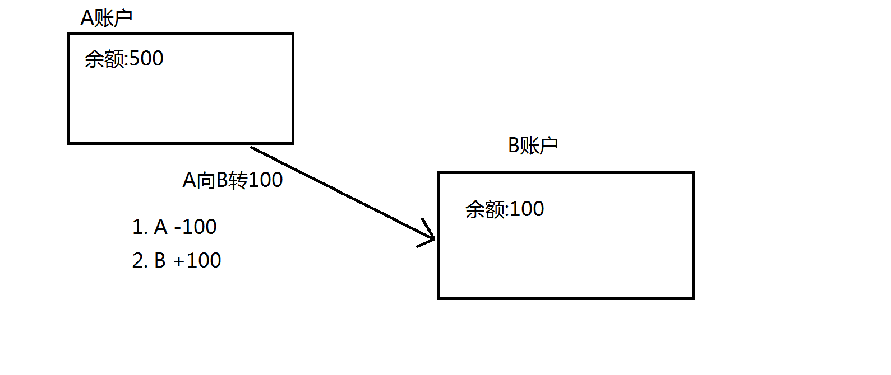

# 事务

>   Transaction

## 事务概念

说到事务最常见的一个例子就是转账



转账本身是一个业务,但是里面的操作涉及A和B两个账户.A账户减100,B账户加100.如果转账成功,两边的改变是都要发生的.如果转账失败任何一方的改变要还原到改变之前.

事务指的是一组操作,里面包含许多单一的逻辑.只要有一个逻辑没有成功,那么都算失败,所有的数据回归最初始的状态,这个回归行为我们叫做回滚.当这些单一的逻辑都执行成功,最终改变后的状态要被持久化(写到本地保存起来).

## 为什么要使用事务

使用事务的目的是为保证数据的完整性和一致性.(参考转账)

## 查看当前数据库的事务状态

```mysql
mysql> show variables like '%commit%';
+-----------------------------------------+-------------------+
| Variable_name                           | Value             |
+-----------------------------------------+-------------------+
| autocommit                              | ON                |
| binlog_group_commit_sync_delay          | 0                 |
| binlog_group_commit_sync_no_delay_count | 0                 |
| binlog_order_commits                    | ON                |
| innodb_api_bk_commit_interval           | 5                 |
| innodb_commit_concurrency               | 0                 |
| innodb_flush_log_at_trx_commit          | 1                 |
| original_commit_timestamp               | 36028797018963968 |
| slave_preserve_commit_order             | OFF               |
+-----------------------------------------+-------------------+
9 rows in set, 1 warning (0.03 sec)
```

## 在MySQL中如何操作事务

从上面我们可以发现事务是自动提交的.所以想要演示首先要把事务的自动提交关闭

```mysql
mysql> set autocommit = off;
Query OK, 0 rows affected (0.00 sec)
```

开启事务

```mysql
mysql> start transaction;
Query OK, 0 rows affected (0.00 sec)
```

这里开启了一个事务,在我们没有结束(即没有提交之前),所有的操作都看作是一个整体中的若干子逻辑.下面来执行若干修改

```mysql
mysql> select * from user;
+----+---------+----------+
| id | name    | pwd      |
+----+---------+----------+
|  1 | Admini  | Abcd1234 |
|  2 | AAAAAAA | A123456  |
|  3 | BBBBBBB | ABABABAB |
+----+---------+----------+
3 rows in set (0.00 sec)

mysql> update user set pwd = '123456' where id = 2;
Query OK, 1 row affected (0.00 sec)
Rows matched: 1  Changed: 1  Warnings: 0

mysql> select * from user;
+----+---------+----------+
| id | name    | pwd      |
+----+---------+----------+
|  1 | Admini  | Abcd1234 |
|  2 | AAAAAAA | 123456   |
|  3 | BBBBBBB | ABABABAB |
+----+---------+----------+
3 rows in set (0.00 sec)

mysql> delete from user where id = 3;
Query OK, 1 row affected (0.00 sec)

mysql> select * from user;
+----+---------+----------+
| id | name    | pwd      |
+----+---------+----------+
|  1 | Admini  | Abcd1234 |
|  2 | AAAAAAA | 123456   |
+----+---------+----------+
2 rows in set (0.00 sec)
```

当我们发现数据的修改不正确的时候我们可以选择回滚到修改前的状态的.在没有插入回滚点的时候都是直接回滚到事务开启的时候

```mysql
mysql> rollback;
Query OK, 0 rows affected (0.10 sec)

mysql> select * from user;
+----+---------+----------+
| id | name    | pwd      |
+----+---------+----------+
|  1 | Admini  | Abcd1234 |
|  2 | AAAAAAA | A123456  |
|  3 | BBBBBBB | ABABABAB |
+----+---------+----------+
3 rows in set (0.00 sec)
```

## 事务的特性(ACID)

事务具备4个特性.分别是

*   原子性

    >   ​	Atomicity

*   一致性

    >   ​	Consistency

*   隔离性

    >   ​	Isolation

*   持久性

    >   ​	Durability

### 原子性

指一个事务中所包含的若干逻辑不可以分隔,是一个有机整体.

### 一致性

事务执行前后数据的完整性

### 隔离性

一个事务在执行期间不应该受到其它事务的影响

### 持久性

当事务执行成功,数据应该永久的保存下来

## 事务的隔离级别

MySQL具备四个隔离级别

| 隔离级别                             | 脏读 | 不可以重复读 | 幻读 |
| ------------------------------------ | ---- | ------------ | ---- |
| 读未提交 read-uncommited             | √    |              |      |
| 读已提交(Oracle默认)read-commited    |      | √            |      |
| 可重复读  repeatable-read(MySQL默认) |      |              | √    |
| 串行化 serializable                  |      |              |      |

### 查看当前隔离级别

```mysql
mysql> show variables like '%isolation%';
+-----------------------+-----------------+
| Variable_name         | Value           |
+-----------------------+-----------------+
| transaction_isolation | REPEATABLE-READ |
+-----------------------+-----------------+
1 row in set, 1 warning (0.00 sec)

mysql>
```

### 设置隔离级别为读未提交

```mysql
mysql> set session transaction isolation level read uncommitted;
Query OK, 0 rows affected (0.00 sec)

```

### 隔离级别所导致的问题

隔离级别会导致事务在读和写上出现问题.这些问题可以归纳为以下几个

*   读
    *   脏读
    *   不可重复读
    *   幻读
*   写
    *   更新丢失
        *   悲观锁:觉得更新丢失一定会发生 在查询是加入for update
        *   乐观锁:觉得更新丢失一定不会发生 加入标志位

#### 脏读

当事务的隔离级别是***读未提交***时,该事务可以读取到另外一个事务尚未提交的数据.为了解决这个问题.我们要把隔离级别修改为***读已提交***

#### 不可重复读

当一个事务的隔离级别是***读已提交***时,该事务可以读取到另外一个事务已经提交的数据.可能会造成前后两次查询的结果不一致.为了解决这个问题,我们需要把隔离级别修改为***可重复读***

#### 幻读

假设有事务A和B,A的隔离级别为***可重复读***,无论B怎么修改数据,A的若干次读取效果都是一样的.当A结束事务以后,再次读取,可以读到B中插入的新数据.这种现象被叫做幻读.解决方法是:把事务的隔离级别设置为串行化

#### 隔离级别的选择

从效率上看有如下关系

读未提交 > 读已提交 > 可重复读 > 串行化

从拦截程度上看有如下关系

串行化 > 可重复读 > 读已提交 > 读未提交

## 在Java代码中使用事务

***事务只和连接有关***.


